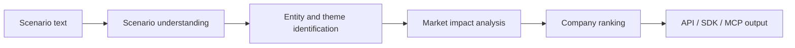

# Scenario Navigator — Showcase

**News scenario in. Ranked stock impact out.**

This is a **public presentation repo**. It does not contain proprietary source code, prompts, ranking weights, or private datasets.

## Product

Scenario Navigator turns a plain-language news or macro scenario into a ranked list of public companies that may be affected, with reasons suitable for research workflows and AI agents.

Live product: [scenarionavigator.io](https://scenarionavigator.io)  
Docs: [scenarionavigator.io/docs](https://scenarionavigator.io/docs)  
Python SDK: [`scenario-navigator` on PyPI](https://pypi.org/project/scenario-navigator/)

## The problem

Analysts and agents can read a headline. Mapping that headline to a defensible, ranked set of tickers still takes time and tribal knowledge.

## What we built

- Scenario analysis API
- Python SDK (`pip install scenario-navigator`)
- MCP tools for agent hosts (`analyze_scenario`, `trending_scenarios`)

## How it works (high level)



## Example (public / synthetic style)

```python
from scenario_navigator_sdk import Client

client = Client.with_trial_token()
analysis = client.analyze(
    "OPEC announces a surprise 2M barrel production cut"
)
for row in analysis.stocks[:5]:
    print(row.stock, row.confidence, row.reason)
```

## Technology (safe to disclose)

- Public HTTP API
- Official Python SDK
- Optional MCP stdio server for agent tooling

## Status

**Production / Beta** — public site, docs, and PyPI package available.

## Learn more

- [scenarionavigator.io](https://scenarionavigator.io)
- [Documentation](https://scenarionavigator.io/docs)
- [PyPI](https://pypi.org/project/scenario-navigator/)
